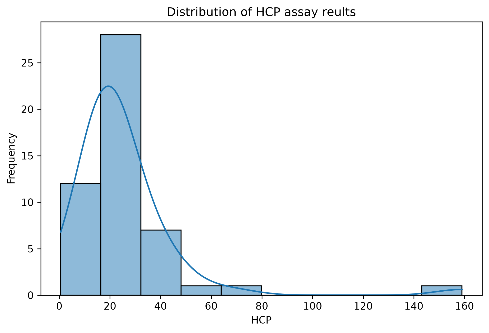
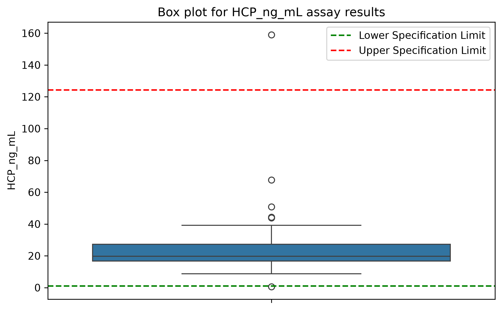
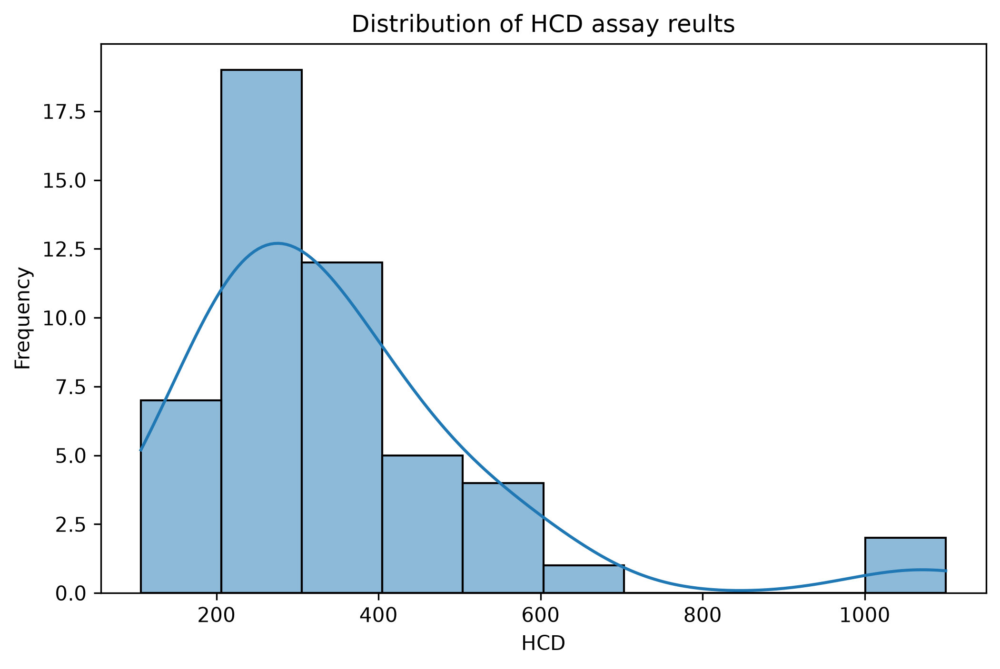
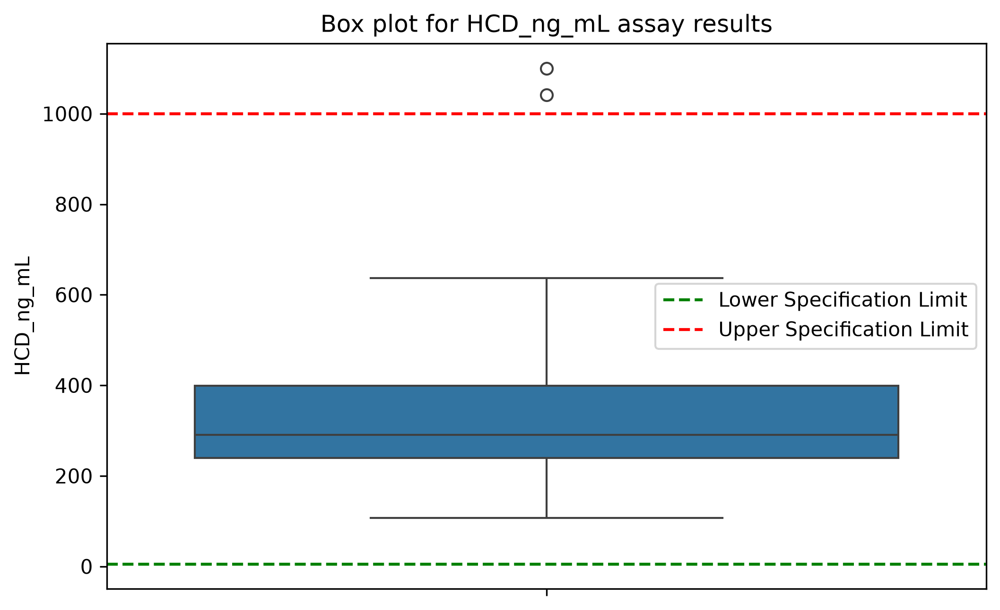
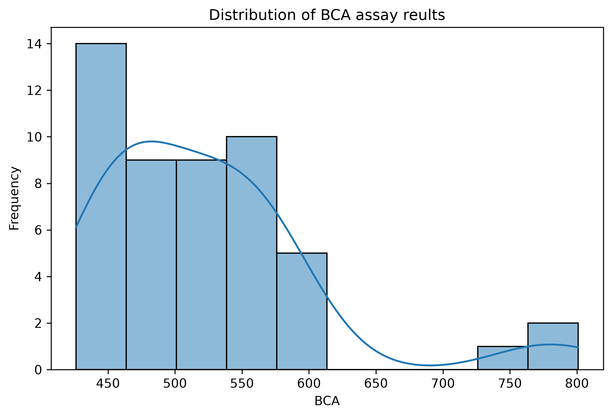
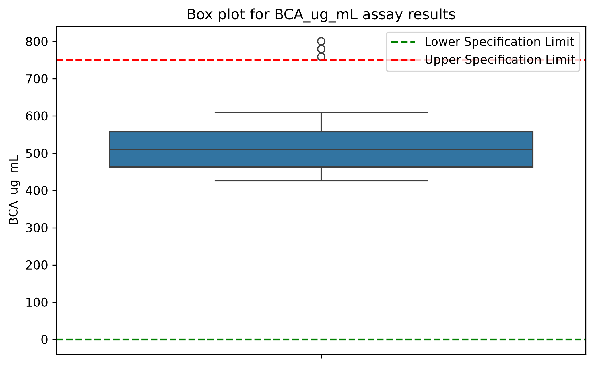
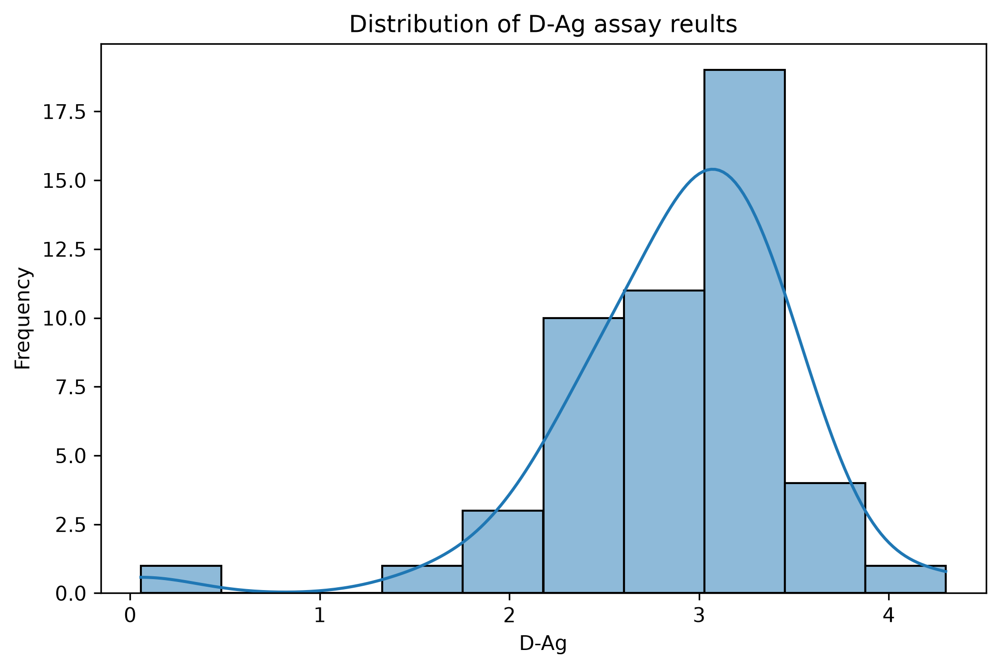
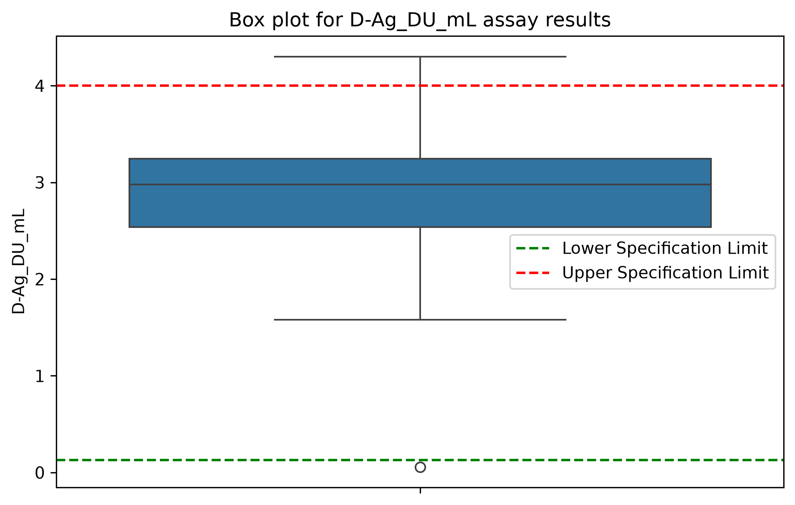

# 🧪 QC & Batch Release Analytics – Vaccine/Biologics Assay Data

<p align="center">
  
  
  
  
</p>

<p align="center">
  <b>Pharmaceutical QC Data Analysis using Python, SQL & Statistical Analysis</b>
</p>
A synthetic dataset of **50 vaccine/biologics batches** was created to simulate a batch-level analytical QC workflow. The dataset contains results for four assays:

- **HCP** – Host Cell Protein
- **HCD** – Host Cell DNA
- **BCA** – Protein concentration 
- **D-Antigen** – D-Ag 

The analysis focuses on data cleaning, validation, specification checks, OOS identification, statistical analysis, outlier detection, and batch-level classification.

> **Note:** The dataset is synthetic and created for educational and portfolio purposes. It does not contain confidential or proprietary pharmaceutical data.

---
## 🔬 Project Overview

This project demonstrates a **pharmaceutical quality control (QC) analytics workflow** using a synthetic vaccine/biologics batch dataset.

The analysis focuses on multiple analytical assays used to evaluate batch quality and demonstrates how laboratory assay results can be transformed into structured QC insights using **Python, SQL, statistical analysis, and data visualization**.

The project covers:

> **Data Cleaning → Validation → Specification Checks → OOS Identification → Batch Classification → Statistical Analysis → Outlier Detection → Visualization**

---

## 🎯 Objectives

- Analyze assay results across pharmaceutical batches
- Validate and clean QC assay data
- Apply specification limits to identify **Out-of-Specification (OOS)** results
- Determine overall batch status based on assay-level results
- Calculate descriptive statistics
- Analyze variability using **Standard Deviation and CV%**
- Identify potential statistical outliers
- Examine assay distributions and skewness
- Generate visualizations to support QC data interpretation

---

## 🧬 Dataset

The dataset contains **50 synthetic vaccine/biologics batches** and four analytical assays.

| Assay | Description | Unit |
|---|---|---|
| **HCP** | Host Cell Protein | ng/mL |
| **HCD** | Host Cell DNA | ng/mL |
| **BCA** | Protein Concentration | µg/mL |
| **D-Antigen** | D-Antigen Assay | DU/mL |

### Dataset Structure

Each row represents **one batch**, while each assay column represents an analytical measurement.

```text
Batch_ID
│
├── HCP
├── HCD
├── BCA
├── D-Antigen
│
├── HCP_Status
├── HCD_Status
├── BCA_Status
├── D_Ag_Status
│
└── Overall_Status
```
---

## 🔄 Analytical Workflow

```text
🧪 Synthetic QC Dataset
          │
          ▼
🧹 Data Cleaning & Validation
          │
          ▼
📏 Specification Checks
          │
          ▼
⚠️ OOS Identification
          │
          ▼
📦 Batch-Level Classification
          │
          ▼
📊 Descriptive Statistics
          │
          ▼
🚨 Outlier Detection
          │
          ▼
📈 Distribution Analysis
          │
          ▼
💡 QC Data Interpretation
```

## 🛠️ Tools & Technologies

<p align="center">
  
  
  
  
</p>

| Tool / Technology | Application in the Project |
|---|---|
| 🐍 **Python** | Data cleaning, validation, statistical analysis and visualization |
| 🐼 **Pandas** | Data manipulation and analysis |
| 🔢 **NumPy** | Numerical calculations and data generation |
| 📊 **Matplotlib** | Assay visualization and distribution analysis |
| 🗃️ **SQL** | Data querying and analytical calculations |
| 📗 **Excel** | Dataset preparation and analytical outputs |
| 📐 **Statistical Analysis** | Mean, median, standard deviation, CV%, skewness and outlier analysis |
---

## 📊 Key Results

### Batch-Level Classification

The analysis classified the 50 batches based on the specification status of all four assays.

| Overall Status | Number of Batches |
|---|---:|
| 🟢 **Pass** | **41** |
| 🟠 **Review** | **9** |
| **Total** | **50** |

A batch was classified as **Review** when one or more assay results were outside the defined specification criteria.

### Assay-Level Specification Results

| Assay | Pass | OOS |
|---|---:|---:|
| **HCP** | 48 | 2 |
| **HCD** | 48 | 2 |
| **BCA** | 47 | 3 |
| **D-Antigen** | 48 | 2 |

---

## ⚠️ OOS Analysis

Specification checks were applied to each assay result to identify **Out-of-Specification (OOS)** observations.

A total of **9 OOS assay observations** were identified across the 50 synthetic batches.

| Batch | Assay | Result | Status |
|---|---|---:|---|
| **B007** | D-Antigen | 0.0567 DU/mL | 🔴 OOS |
| **B008** | HCP | 158.987 ng/mL | 🔴 OOS |
| **B014** | HCP | 0.587 ng/mL | 🔴 OOS |
| **B015** | HCD | 1100.00 ng/mL | 🔴 OOS |
| **B021** | D-Antigen | 4.30 DU/mL | 🔴 OOS |
| **B022** | HCD | 1042.00 ng/mL | 🔴 OOS |
| **B029** | BCA | 800.876 µg/mL | 🔴 OOS |
| **B044** | BCA | 780.00 µg/mL | 🔴 OOS |
| **B049** | BCA | 760.00 µg/mL | 🔴 OOS |

### Batch-Level Interpretation

If **any individual assay** in a batch was classified as OOS, the overall batch status was classified as **Review**.
#### Example: Batch B008

<pre>
Batch B008
    │
    ├── HCP       → 🔴 OOS
    ├── HCD       → 🟢 Pass
    ├── BCA       → 🟢 Pass
    └── D-Antigen → 🟢 Pass
                       │
                       ▼
                  🟠 REVIEW
</pre>
---

## 📈 Statistical Analysis

Descriptive statistical analysis was performed to understand the **central tendency, variability, and distribution characteristics** of each assay.

| Assay | Mean | Median | Standard Deviation | CV% | Skewness |
|---|---:|---:|---:|---:|---:|
| **HCP** | 25.54 | 19.80 | 22.56 | 88.31% | 4.52 |
| **HCD** | 349.26 | 290.56 | 194.81 | 55.78% | 2.14 |
| **BCA** | 522.53 | 510.03 | 82.62 | 15.81% | 1.77 |
| **D-Antigen** | 2.89 | 2.98 | 0.64 | 22.23% | -1.77 |

### Statistical Measures Used

- **Mean** – Average assay result across the batches.
- **Median** – Middle value of the ordered observations.
- **Standard Deviation (SD)** – Measures the variability of assay results.
- **Coefficient of Variation (CV%)** – Measures relative variability.
- **Skewness** – Describes the asymmetry of the data distribution.

---

## 🚨 Outlier Analysis

Statistical outlier analysis identified **12 potential outlier observations** across the four assays.

## 📊 Data Visualizations

The following visualizations were created to examine assay distributions, variability, and potential unusual observations across batches.

### HCP – Host Cell Protein

<p align="center">
  
</p>

<p align="center">
  
</p>

### HCD – Host Cell DNA

<p align="center">
  
</p>

<p align="center">
  
</p>

### BCA – Protein Concentration

<p align="center">
  
</p>

<p align="center">
  
</p>

### D-Antigen

<p align="center">
  
</p>

<p align="center">
  
</p>
> **Important:** A statistical outlier is not automatically an OOS result.

Outlier detection was performed as an additional analytical step to identify unusual observations that may warrant further investigation.

Specification limits were used separately to determine **OOS status**, while statistical outlier detection was used to examine unusual patterns within the assay data.
